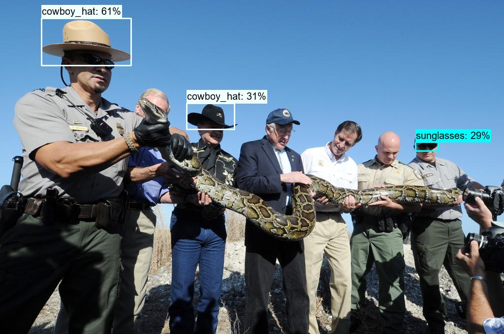

# CowBoy Outfits Detection
该项目主要是在复现yolov3论文基础上添加SPP结构来实现自己的项目，具体源码复现https://github.com/ultralytics/yolov3
主要对cowboyoutfits做五类的多目标检测，共对这五类做目标检测belt,sunglasses,boot,cowboy_hat,jacket

  

# 实现细节
原始COCO格式标注转换为网络需要的YOLO格式；
进行迁移学习，加载预训练模型参数，通过调整学习率进行针对性微调；
根据训练集目标尺寸采用K-Means聚类生成9组Anchor，采用多尺度特征融合与SPP模块提升不同尺度目标的检测能力；
训练集使用Mosaic数据增强及多尺度训练数据处理；
训练阶段采用SGD优化器、使用余弦退火学习率衰减、学习率调度及AMP混合精度训练；
验证阶段计算mAP@0.5、mAP@[0.5:0.95]等指标，并完成模型推理及检测框可视化。
